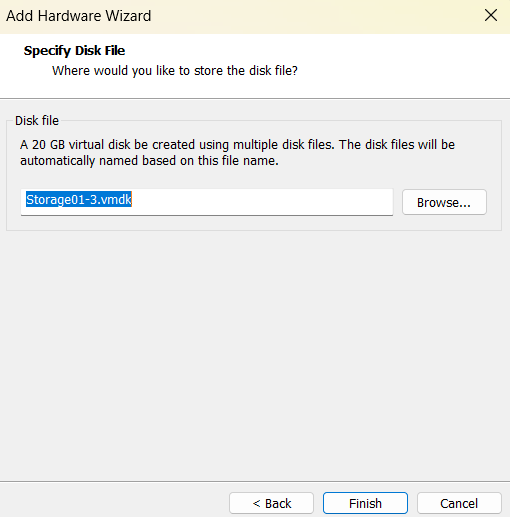

# Déploiement OpenStack HA avec Kolla-Ansible

<p align="center">
  
</p>

<p align="center">
  
  
  
  
</p>

---

## 📋 Table des matières

- [Présentation](#présentation)
- [Prérequis](#prérequis)
- [Architecture du déploiement](#architecture-du-déploiement)
- [Rôles des nœuds](#rôles-des-nœuds)
- [Plan d'adressage réseau](#plan-dadressage-réseau)
- [Étape 1 : Création de la VM de base](#étape-1--création-de-la-vm-de-base)
- [Étape 2 : Installation de Rocky Linux 10.2](#étape-2--installation-de-rocky-linux-102)
- [Étape 3 : Configuration post-installation](#étape-3--configuration-post-installation)
- [Étape 4 : Clonage et configuration des nœuds](#étape-4--clonage-et-configuration-des-nœuds)
- [Étape 5 : Configuration spécifique par rôle](#étape-5--configuration-spécifique-par-rôle)
- [Étape 6 : Configuration du partage NFS](#étape-6--configuration-du-partage-nfs)
- [Étape 7 : Préparation SSH et installation de Kolla-Ansible](#étape-7--préparation-ssh-et-installation-de-kolla-ansible)
- [Services déployés](#services-déployés)
- [Vérification et validation](#vérification-et-validation)
- [Annexes](#annexes)

---

## 🎯 Présentation

Ce projet documente le déploiement complet d'un **cloud OpenStack à haute disponibilité (HA)** à l'aide de **Kolla-Ansible** sur **Rocky Linux 10.2**.

### Objectifs

- Fournir une infrastructure cloud résiliente et scalable
- Automatiser le déploiement via Kolla-Ansible
- Assurer la haute disponibilité des services critiques
- Conteneuriser l'ensemble des services OpenStack avec Docker
- Mettre en place une architecture multi-nœuds conforme aux bonnes pratiques

### Composants clés

| Composant | Version |
|-----------|---------|
| OpenStack | 2024.2 (Dalmatian) |
| Système d'exploitation | Rocky Linux 10.2 |
| Moteur de conteneurs | Docker |
| Orchestrateur | Kolla-Ansible |
| Base de données | MariaDB Galera Cluster |
| File d'attente | RabbitMQ HA |
| Équilibrage de charge | HAProxy + Keepalived |
| Hyperviseur | VMware Workstation |

> **Public cible :** Ingénieurs DevOps, architectes cloud, administrateurs systèmes avancés.

---

## 📌 Prérequis

Avant de commencer, assurez-vous de maîtriser :

- **Linux** : Gestion des utilisateurs, systemd, partitions, SELinux
- **Réseaux** : Configuration d'interfaces, routage, VLAN
- **Ansible** : Inventaires, playbooks, rôles (niveau intermédiaire)
- **VMware** : Création et configuration de machines virtuelles

### Ressources matérielles requises

| Nœud | CPU | RAM | Disque |
|------|-----|-----|--------|
| Contrôleur (x3) | 8 vCPU | 24 Go | 150-200 Go |
| Compute (x1) | 4 vCPU | 16 Go | 100 Go |
| Network (x1) | 4 vCPU | 16 Go | 80 Go |
| Storage (x1) | 4 vCPU | 8 Go | 100 Go + 60 Go (Swift) |

**Total approximatif :** 40 vCPU, 112 Go RAM, 1,1 To stockage

---

## 🏗 Architecture du déploiement

### Vue d'ensemble

Le cluster est composé de **6 nœuds** provisionnés sous VMware Workstation. La VM `controller01` sert de template pour le clonage des autres nœuds.

```
┌─────────────────────────────────────────────────────────────────┐
│                    RÉSEAU DE GESTION (172.20.10.0/28)          │
├─────────────────────────────────────────────────────────────────┤
│                                                                 │
│  ┌─────────────┐  ┌─────────────┐  ┌─────────────┐             │
│  │ Controller01 │  │ Controller02 │  │ Controller03 │             │
│  │  .2          │  │  .3          │  │  .5          │             │
│  └──────┬──────┘  └──────┬──────┘  └──────┬──────┘             │
│         │                │                │                     │
│         └────────────────┼────────────────┘                     │
│                          │                                      │
│          ┌───────────────┼───────────────┐                     │
│          │               │               │                     │
│  ┌───────┴───────┐ ┌─────┴─────┐ ┌───────┴───────┐             │
│  │  Compute01    │ │ Network01 │ │  Storage01    │             │
│  │  .6           │ │  .7       │ │  .8           │             │
│  └───────────────┘ └───────────┘ └───────────────┘             │
│                                                                 │
└─────────────────────────────────────────────────────────────────┘
```

### Plan d'adressage réseau

| Nom d'hôte | Rôle | IPv4 (ens160) | vCPU | RAM | Stockage |
|------------|------|--------------|------|-----|----------|
| `controller01` | Contrôleur + Déploiement | 172.20.10.2 | 8 | 24 Go | 200 Go |
| `controller02` | Contrôleur | 172.20.10.3 | 8 | 24 Go | 200 Go |
| `controller03` | Contrôleur | 172.20.10.5 | 8 | 24 Go | 200 Go |
| `compute01` | Calcul | 172.20.10.6 | 4 | 16 Go | 100 Go |
| `network01` | Réseau | 172.20.10.7 | 4 | 16 Go | 80 Go |
| `storage01` | Stockage | 172.20.10.8 | 4 | 8 Go | 160 Go |

> **⚠️ Règle de quorum :** Les contrôleurs doivent être en **nombre impair** (3, 5, 7…) pour que Galera et Keepalived fonctionnent correctement en HA.

### Interfaces réseau

Chaque nœud dispose de **deux interfaces réseau** :

| Interface | Rôle | Configuration |
|-----------|------|---------------|
| `ens160` | Réseau de gestion (API, réplication, stockage) | IP statique dans 172.20.10.0/28 |
| `ens192` | Réseau externe (flottantes, provider) | **Sans IP** — gérée par Neutron (OVS) |

> **Note :** Les noms d'interface peuvent varier (`ens160`, `ens192`, `eth0`, etc.). Vérifiez avec `ip a` après création.

---

## 🎭 Rôles des nœuds

### Contrôleurs (`controller01`, `controller02`, `controller03`)

Les nœuds de contrôle forment le **plan de contrôle** du cloud.

| Service | Fonction |
|---------|----------|
| **Keystone** | Authentification et gestion des identités |
| **Glance** | Catalogue d'images (stockage NFS partagé) |
| **Nova API/Scheduler/Conductor** | Orchestration des ressources de calcul |
| **Neutron Server** | API réseau |
| **Horizon** | Interface web d'administration |
| **MariaDB (Galera)** | Base de données clusterisée HA |
| **RabbitMQ** | File d'attente de messages (mode HA) |
| **Memcached** | Cache de sessions |
| **HAProxy + Keepalived** | Équilibrage de charge + VIP HA |
| **Prometheus + Grafana** | Monitoring et visualisation |
| **Heat** | Orchestration (stacks) |
| **Barbican** | Gestion des secrets |

### Nœud réseau (`network01`)

Gère la connectivité réseau des instances.

| Service | Fonction |
|---------|----------|
| **Neutron OVS Agent** | Réseaux overlay (VXLAN/GRE) |
| **Neutron L3 Agent** | Routage inter-réseaux et NAT |
| **Neutron DHCP Agent** | Attribution d'IP aux instances |
| **Neutron Metadata Agent** | Métadonnées pour les instances |

### Nœud de calcul (`compute01`)

Exécute les machines virtuelles des locataires.

| Service | Fonction |
|---------|----------|
| **Nova Compute** | Cycle de vie des VMs |
| **Libvirt/KVM** | Hyperviseur (virtualisation imbriquée) |
| **Neutron OVS Agent** | Connectivité réseau des VMs |
| **Ceilometer Compute** | Métriques au niveau compute |

### Nœud de stockage (`storage01`)

Fournit du stockage persistant en mode bloc et objet.

| Service | Fonction |
|---------|----------|
| **Cinder Volume** | Volumes bloc (backend LVM) |
| **Cinder Backup** | Sauvegarde vers Swift |
| **LVM** | Gestion des volumes logiques |
| **iSCSI/tgtd** | Export iSCSI pour Cinder |
| **Swift** | Stockage objet distribué (account/container/object) |

---

## 🖥 Étape 1 : Création de la VM de base

Créez une VM `controller01` qui servira de template.

### 1.1 Spécifications matérielles

| Paramètre | Valeur |
|-----------|--------|
| vCPU | 8 (minimum 4) |
| RAM | 24 Go (minimum 16 Go) |
| Disque | 200 Go (Thin Provision) |
| NIC 1 (ens160) | Bridged |
| NIC 2 (ens192) | Bridged |


### 1.2 Configuration réseau dans VMware

1. **Ajouter NIC 1** (réseau de gestion) :
   - Mode : Bridged
   - Connectée au démarrage : Oui

   

2. **Ajouter NIC 2** (réseau externe) :
   - Mode : Bridged
   - Connectée au démarrage : Oui

   

3. **Vérification finale** :
   

---

## 💿 Étape 2 : Installation de Rocky Linux 10.2

### 2.1 Téléchargement

Téléchargez l'ISO minimal : [Rocky Linux 10.2](https://rockylinux.org/download)

### 2.2 Installation

Démarrez la VM et lancez l'installation.


#### Configuration à effectuer

| Paramètre | Action |
|-----------|--------|
| Langue | Français ou Anglais |
| Partitionnement | Automatique (LVM recommandé) |
| Réseau | Configurer `ens160` et `ens192` |
| Fuseau horaire | Europe/Paris (ou votre région) |
| Mot de passe root | Définir un mot de passe fort |
| Utilisateur | Créer `kolla` (administrateur) |


#### Configuration réseau détaillée

1. **`ens160` (réseau de gestion)** :
   - Activer DHCP temporairement
   - L'IP statique sera configurée après installation

2. **`ens192` (réseau externe)** :
   - **Désactiver IPv4 complètement**
   - Cette interface sera gérée par Neutron


Validez et lancez l'installation.


---

## ⚙️ Étape 3 : Configuration post-installation

> **Effectuer toutes ces opérations sur `controller01` AVANT tout clonage.**

### 3.1 Mise à jour du système

```bash
sudo dnf update -y
```

### 3.2 Configuration de l'utilisateur `kolla`

L'utilisateur `kolla` exécutera Kolla-Ansible sur tous les nœuds.

```bash
# Ajouter au groupe wheel pour sudo
sudo usermod -aG wheel kolla

# Vérification
grep wheel /etc/group
```

**Configurer sudo sans mot de passe :**

```bash
# Vérification syntaxique initiale
sudo visudo -c

# Modification de sudoers
sudo sed -i \
  -e 's/^\s*%wheel\s*ALL=(ALL)\s*ALL\s*$/# &/' \
  -e 's/^\s*#\s*%wheel\s*ALL=(ALL)\s*NOPASSWD:\s*ALL\s*$/%wheel ALL=(ALL) NOPASSWD: ALL/' \
  /etc/sudoers

# Vérification syntaxique finale
sudo visudo -c
```

### 3.3 Installation des paquets prérequis

```bash
sudo dnf install -y tar gzip unzip openssl
```

### 3.4 Vérification réseau

```bash
# Lister toutes les interfaces
ip a

# Affichage compact des IP
ip -br -4 addr show
```

**Résultat attendu :**
- `ens160` : UP avec IP (DHCP temporaire)
- `ens192` : UP (ou DOWN) **sans IP**

---

## 🧬 Étape 4 : Clonage et configuration des nœuds

### 4.1 Clonage des VMs

1. **Éteindre `controller01`** avant de cloner.
2. Utiliser l'option **"Full Clone"** (clone indépendant) dans VMware.


3. Répéter pour : `controller02`, `controller03`, `compute01`, `network01`, `storage01`.


### 4.2 Configuration de chaque nœud

> **À effectuer sur CHAQUE nœud après clonage.**

#### Définir le nom d'hôte

```bash
sudo hostnamectl set-hostname <hostname>
hostname  # Vérification
```

#### Configurer l'IP statique sur `ens160`

```bash
# Remplacer X par l'IP du nœud (voir tableau d'adressage)
sudo nmcli con mod ens160 ipv4.addresses 172.20.10.X/28
sudo nmcli con mod ens160 ipv4.gateway 172.20.10.1
sudo nmcli con mod ens160 ipv4.dns '8.8.8.8 1.1.1.1'
sudo nmcli con mod ens160 ipv4.method manual

# Redémarrer l'interface
sudo nmcli con down ens160 && sudo nmcli con up ens160

# Vérifier
ip a show ens160
```

### 4.3 Configuration du fichier `/etc/hosts`

**Sur `controller01` uniquement**, ajoutez les entrées suivantes :

```bash
sudo nano /etc/hosts
```

```text
172.20.10.2  controller01
172.20.10.3  controller02
172.20.10.5  controller03
172.20.10.6  compute01
172.20.10.7  network01
172.20.10.8  storage01
```

**Tester la connectivité :**

```bash
for host in controller01 controller02 controller03 compute01 network01 storage01; do
  ping -c 1 $host >/dev/null && echo "$host : OK" || echo "$host : UNREACHABLE"
done
```

---

## 🔧 Étape 5 : Configuration spécifique par rôle

### 5.1 Virtualisation imbriquée sur `compute01`

Activez la virtualisation imbriquée pour que KVM fonctionne dans la VM.

1. Ouvrir les paramètres de `compute01` dans VMware
2. Activer **"Virtualize Intel VT-x/EPT or AMD-V/RVI"**


### 5.2 Préparation du stockage sur `storage01`

#### Ajouter les disques dans VMware

Ajoutez :
- 1 disque de 20 Go pour Cinder
- 3 disques de 20 Go pour Swift




#### Vérification des disques

```bash
lsblk
# Vous devriez voir : nvme0n2, nvme0n3, nvme0n4, nvme0n5
```

#### Préparer le volume LVM pour Cinder

```bash
# Créer le volume physique
sudo pvcreate /dev/nvme0n2

# Créer le groupe de volumes
sudo vgcreate cinder-volumes /dev/nvme0n2

# Vérifier
sudo vgs
```

#### Préparer les disques pour Swift

```bash
index=0
for d in nvme0n3 nvme0n4 nvme0n5; do
    sudo parted /dev/${d} -s -- mklabel gpt mkpart KOLLA_SWIFT_DATA 1 -1
    sudo mkfs.xfs -f -L d${index} /dev/${d}p1
    (( index++ ))
done
```

> **Note :** Adaptez les noms de disques (`nvme0nX`) selon la sortie de `lsblk`.

---

## 📁 Étape 6 : Configuration du partage NFS

Glance (catalogue d'images) nécessite un stockage partagé entre les trois contrôleurs. `storage01` joue le rôle de serveur NFS.

> ⚠️ **Point de vigilance :** Le serveur NFS unique est un SPOF (Single Point of Failure). Pour la production, utilisez une solution redondante (NAS/SAN).

### 6.1 Configuration du serveur NFS (storage01)

```bash
# Installation du serveur NFS
sudo dnf install -y nfs-utils

# Création du répertoire partagé
sudo mkdir -p /srv/nfs/glance
sudo chmod 755 /srv/nfs/glance

# Export du partage
echo "/srv/nfs/glance 172.20.10.0/28(rw,sync,no_subtree_check,no_root_squash)" | \
  sudo tee -a /etc/exports

# Démarrage du service
sudo systemctl enable --now nfs-server
sudo exportfs -ra
sudo exportfs -v  # Vérification

# Configuration du firewall
sudo firewall-cmd --permanent \
  --add-service=nfs \
  --add-service=rpc-bind \
  --add-service=mountd
sudo firewall-cmd --reload
```

> `no_root_squash` est obligatoire pour permettre aux conteneurs Glance d'écrire dans le répertoire en tant que root.

### 6.2 Montage sur les contrôleurs

**Répéter sur `controller01`, `controller02` et `controller03` :**

```bash
sudo dnf install -y nfs-utils

sudo mkdir -p /mnt/glance

# Ajout au fstab
echo "172.20.10.8:/srv/nfs/glance /mnt/glance nfs defaults,_netdev 0 0" | \
  sudo tee -a /etc/fstab

# Montage
sudo mount -a

# Vérification
df -h /mnt/glance
```

### 6.3 Test du partage

```bash
# Depuis controller01
sudo touch /mnt/glance/test-partage

# Depuis controller02 et controller03
ls -la /mnt/glance/test-partage  # Doit être visible

# Nettoyage
sudo rm /mnt/glance/test-partage
```

> **⚠️ Si le fichier n'est pas visible, ne continuez pas !** Le partage NFS n'est pas fonctionnel.

### 6.4 Configuration SELinux

Sur Rocky Linux, SELinux peut bloquer l'accès NFS aux conteneurs :

```bash
# Diagnostiquer les problèmes SELinux
sudo ausearch -m avc -ts recent

# Autoriser l'accès NFS
sudo setsebool -P virt_use_nfs on
```

---

## 🔑 Étape 7 : Préparation SSH et installation de Kolla-Ansible

### 7.1 Génération des clés SSH

**Sur `controller01`, en tant qu'utilisateur `kolla` :**

```bash
# Génération de la clé SSH
ssh-keygen -t rsa -b 4096 -N "" -f ~/.ssh/id_rsa

# Copie sur tous les nœuds
for host in controller01 controller02 controller03 compute01 network01 storage01; do
  ssh-copy-id kolla@$host
done

# Test de connexion
ssh kolla@controller03
```

### 7.2 Installation de Kolla-Ansible

Toutes les étapes suivantes sont exécutées sur `controller01` en tant qu'utilisateur `kolla`.

```bash
# Mise à jour du système
sudo dnf update -y

# Installation des dépendances
sudo dnf install -y git python3-devel libffi-devel gcc openssl-devel python3-libselinux
```

#### Créer un environnement virtuel Python

```bash
python3 -m venv ~/kolla-ansible
source ~/kolla-ansible/bin/activate
pip install --upgrade pip
```

#### Installer Ansible

```bash
pip install ansible-core
```

#### Configurer Ansible

```bash
cat > $HOME/ansible.cfg << 'EOF'
[defaults]
host_key_checking=False
pipelining=True
forks=100
EOF
```

#### Installer Kolla-Ansible

```bash
source ~/kolla-ansible/bin/activate
pip install kolla-ansible

# Création du répertoire de configuration
sudo mkdir -p /etc/kolla
sudo chown $USER:$USER /etc/kolla

# Copie des fichiers de configuration
cp -r /usr/local/share/kolla-ansible/etc_examples/kolla/* /etc/kolla/

# Copie de l'inventaire multinœud
cp /usr/local/share/kolla-ansible/ansible/inventory/multinode .

# Installation des dépendances Ansible Galaxy
kolla-ansible install-deps
```

---

