# Déploiement OpenStack HA avec Kolla-Ansible

<p align="center">
  
</p>

<p align="center">
  
  
  
  
</p>

---

## Table des matières

- [Présentation](#présentation)
- [Environnement de test](#environnement-de-test)
- [Architecture du déploiement](#architecture-du-déploiement)
- [Rôles des nœuds](#rôles-des-nœuds)
- [Réseau des machines virtuelles](#réseau-des-machines-virtuelles)
- [Services déployés](#services-déployés)
- [Étape 1 — Création de la VM de base](#étape-1--création-de-la-vm-de-base)
- [Étape 2 — Installation de Rocky Linux 10.2](#étape-2--installation-de-rocky-linux-102)
- [Étape 3 — Configuration post-installation](#étape-3--configuration-post-installation)
- [Bonnes pratiques](#bonnes-pratiques)

---

## Présentation

Ce projet documente le processus complet de déploiement d'un environnement **cloud OpenStack à haute disponibilité (HA)** à l'aide de **Kolla-Ansible**. Le déploiement comprend :

- Architecture multi-nœuds (controller, compute, storage, network)
- Conteneurisation complète avec **Docker**
- Cluster **Galera** + **HAProxy** + **Keepalived** pour la haute disponibilité
- Configuration centralisée via **Ansible**
- Machines virtuelles provisionnées sous **VMware Workstation**

> Ce guide s'adresse aux ingénieurs **DevOps**, aux architectes **cloud** et aux administrateurs système avancés. Il détaille les procédures permettant de reproduire ce déploiement aussi bien en environnement de laboratoire qu'en production.

> **Prérequis :** Ce guide suppose une connaissance de base de **Linux**, **Réseaux** et **Ansible**.

---

## Environnement de test

| Composant | Version / Détail |
|-----------|-----------------|
| Système d'exploitation | Rocky Linux 10.2 (ISO minimal) |
| Plateforme cloud | OpenStack 2024.2 (Dalmatian) |
| Outil de déploiement | Kolla-Ansible |
| Moteur de conteneurs | Docker |
| Hyperviseur | VMware Workstation |
| Orchestrateur | Ansible |

---

## Architecture du déploiement

Le déploiement a été réalisé dans un laboratoire virtualisé sous **VMware Workstation**. Une machine virtuelle de base (`controller01`) a été créée, puis clonée pour produire les nœuds supplémentaires — chacun se voyant attribuer le rôle qui lui est dévolu.

Toutes les machines virtuelles fonctionnent sous **Rocky Linux 10.2 (ISO minimal)** et partagent, à l'origine, les mêmes spécifications matérielles, lesquelles sont ensuite adaptées en fonction du rôle assigné à chaque nœud.

| Nom d'hôte | Rôle | IPv4 | vCPU | RAM (Go) | Stockage (Go) | Notes |
|------------|------|------|------|----------|---------------|-------|
| `controller01` | Nœud de contrôle | 172.20.10.2 | 8 | 24 | 150–200 | Nœud de déploiement Kolla |
| `controller02` | Nœud de contrôle | 172.20.10.3 | 8 | 24 | 150–200 | |
| `controller03` | Nœud de contrôle | 172.20.10.5 | 8 | 24 | 150–200 | |
| `compute01` | Nœud de calcul | 172.20.10.6 | 4 | 16 | 100 | Virtualisation imbriquée activée |
| `network01` | Nœud réseau | 172.20.10.7 | 4 | 16 | 80 | |
| `storage01` | Nœud de stockage | 172.20.10.8 | 4 | 8 | 100 + 60 (Swift) | Volume LVM pour Cinder |

> ⚠️ **Règle de quorum HA :** Les nœuds contrôleurs doivent toujours être en **nombre impair** (3, 5, 7…) pour que le cluster MariaDB Galera et Keepalived puissent élire un leader en cas de défaillance.

---

## Rôles des nœuds

### Contrôleurs — `controller01`, `controller02`, `controller03`

Les nœuds de contrôle constituent le **cerveau** du cloud OpenStack. Ils hébergent toutes les API, la base de données, la messagerie et l'équilibrage de charge.

| Service | Description |
|---------|-------------|
| `Keystone` | Gestion des identités et authentification |
| `Glance` | Catalogue d'images (stockage local sur `/mnt/glance`) |
| `Nova API / Scheduler / Conductor` | Gestion des ressources de calcul |
| `Neutron Server` | API réseau |
| `Horizon` | Interface web (Dashboard) |
| `MariaDB (Galera)` | Base de données en cluster HA |
| `RabbitMQ` | File d'attente de messages (HA) |
| `Memcached` | Cache de sessions |
| `HAProxy + Keepalived` | Équilibrage de charge et VIP haute disponibilité |
| `Prometheus + Grafana` | Monitoring et métriques |

---

### Réseau — `network01`

Le nœud réseau gère toute la connectivité réseau des instances.

| Service | Description |
|---------|-------------|
| `Neutron OVS Agent` | Gestion des réseaux overlay (VXLAN / GRE) |
| `Neutron L3 Agent` | Routage inter-réseaux et NAT |
| `Neutron DHCP Agent` | Attribution d'adresses IP aux instances |
| `Neutron Metadata Agent` | Fournit des métadonnées aux instances |

---

### Calcul — `compute01`

Le nœud de calcul exécute les machines virtuelles des locataires (tenants).

| Service | Description |
|---------|-------------|
| `Nova Compute` | Cycle de vie des VMs |
| `Libvirt / KVM` | Hyperviseur pour l'exécution des VMs |
| `Neutron OVS Agent` | Connectivité réseau des VMs |
| `Ceilometer Compute` | Collecte de métriques au niveau compute |
| `Prometheus Node Exporter` | Monitoring des ressources du nœud |

---

### Stockage — `storage01`

Le nœud de stockage fournit du stockage persistant (volumes bloc et objets).

| Service | Description |
|---------|-------------|
| `Cinder Volume` | Gestion des volumes (stockage bloc LVM) |
| `Cinder Backup` | Sauvegarde des volumes vers Swift |
| `LVM` | Gestion des volumes logiques (`cinder-volumes`) |
| `iscsid / tgtd` | Services iSCSI pour les volumes Cinder |
| `Swift (account / container / object)` | Stockage objet distribué |
| `Prometheus Node Exporter` | Monitoring des ressources du nœud |

---

## Réseau des machines virtuelles

Chaque machine virtuelle dispose d'**au moins deux interfaces réseau** :

| Interface | Rôle | Configuration |
|-----------|------|---------------|
| `ens160` | Réseau de gestion OpenStack (API, réplication, stockage) | IP statique configurée |
| `ens192` | Réseau externe — IP flottantes et accès provider | Pas d'IP (bridge Neutron) |

> ⚠️ Les noms d'interfaces (`ens160`, `ens192`) peuvent varier selon la configuration de l'hyperviseur. Vérifiez toujours avec `ip a` après la création ou le clonage d'une VM.

---

## Services déployés

### Services cœur

| Service | Statut | Description |
|---------|--------|-------------|
| **Keystone** | ✅ Activé | Authentification et identité |
| **Glance** | ✅ Activé | Catalogue d'images |
| **Nova** | ✅ Activé | Service de calcul |
| **Neutron** | ✅ Activé | Service réseau (OVS) |
| **Horizon** | ✅ Activé | Dashboard web |
| **Heat** | ✅ Activé | Orchestration (stacks) |
| **Cinder** | ✅ Activé | Stockage bloc (LVM) |

### Monitoring & Télémétrie

| Service | Statut | Description |
|---------|--------|-------------|
| **Prometheus** | ✅ Activé | Collecte de métriques |
| **Grafana** | ✅ Activé | Visualisation des métriques |
| **Ceilometer** | ✅ Activé | Collecte des données de consommation |
| **Aodh** | ✅ Activé | Alertes et alarmes |
| **Gnocchi** | ✅ Activé | Stockage des métriques (backend `file`) |

### Services avancés

| Service | Statut | Description |
|---------|--------|-------------|
| **Zun** | ✅ Activé | Gestion des conteneurs applicatifs |
| **Kuryr** | ✅ Activé | Intégration réseau pour les conteneurs |
| **Swift** | ✅ Activé | Stockage objet distribué |
| **Barbican** | ✅ Activé | Gestion des secrets et chiffrement |
| **Magnum** | ✅ Activé | Orchestration Kubernetes (clusters K8s) |
| **Designate** | ✅ Activé | Service DNS as a Service |
| **Octavia** | ✅ Activé | Load Balancer as a Service |

---

## Étape 1 — Création de la VM de base

Cette étape consiste à créer une **machine virtuelle de référence** (`controller01`) qui servira de base pour cloner tous les autres nœuds du cluster.

### 1.1 Paramètres matériels recommandés

Créez une nouvelle VM avec les ressources suivantes (minimum pour le nœud de base, à adapter par la suite selon le rôle) :

| Paramètre | Valeur recommandée |
|-----------|-------------------|
| vCPU | 4 (minimum 2) |
| RAM | 16 Go (minimum 8 Go) |
| Disque | 60 Go+ (Thin Provision) |
| Type de disque | Thin Provision (économise l'espace sur le datastore) |

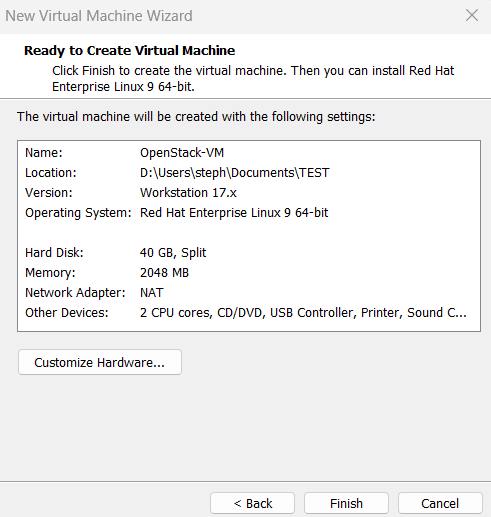

### 1.2 Configuration réseau de la VM

Ajoutez **une deuxième cartes réseau (NIC)** à la machine virtuelle :

| NIC | Réseau VMware | Rôle OpenStack |
|-----|---------------|----------------|
| NIC 1 (`ens160`) | Bridged | API, réplication, stockage |
| NIC 2 (`ens192`) | Bridged | Provider networks, IPs flottantes |

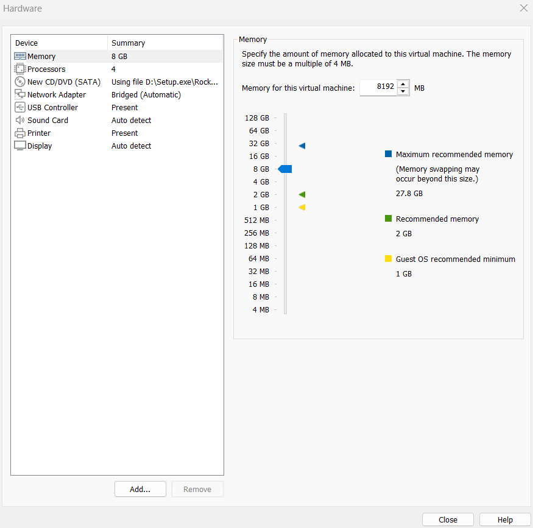
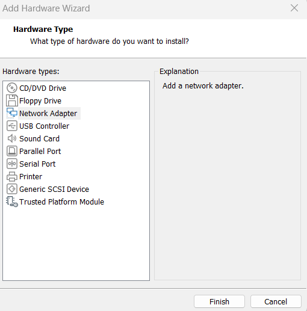

Vérifiez le résumé de configuration avant de valider.

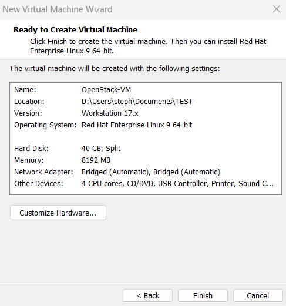

---

## Étape 2 — Installation de Rocky Linux 10.2

> **Télécharger l'ISO Rocky Linux 10.2 (minimal) :**
> [https://rockylinux.org/download](https://rockylinux.org/download)

Démarrez la VM et lancez l'installation de Rocky Linux.

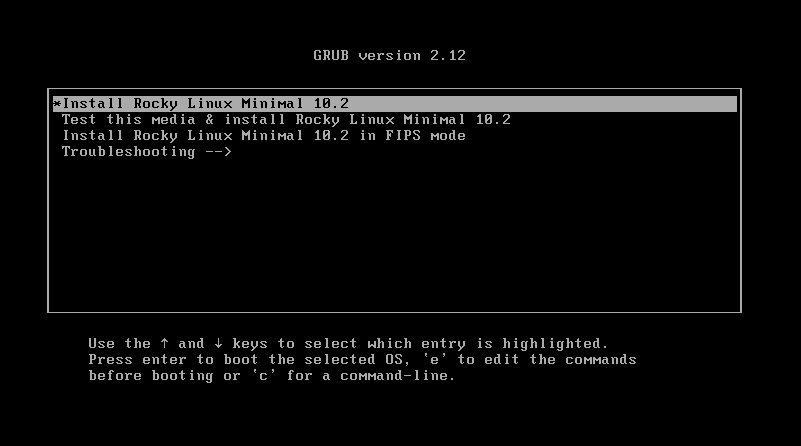

### 2.1 Langue d'installation

Sélectionnez la langue d'installation souhaitée (le Français est supporté).

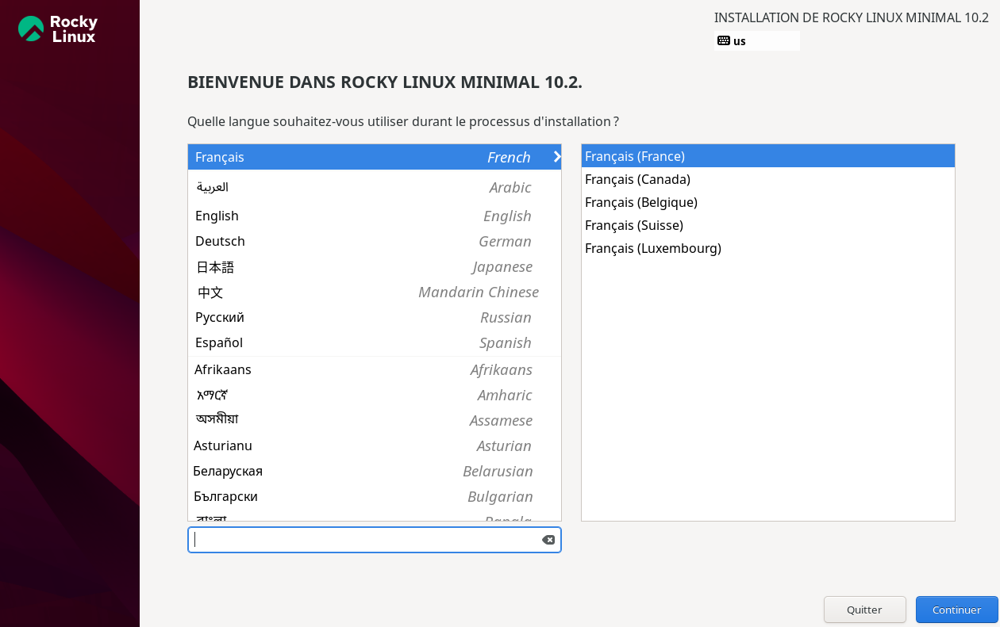

### 2.2 Paramètres à configurer

Sur l'écran de sommaire d'installation, configurez les éléments suivants :

| Paramètre | Recommandation |
|-----------|----------------|
| Partitionnement | Automatique ou manuel (LVM recommandé) |
| Réseau et nom d'hôte | Configurer `ens160` et `ens192` |
| Fuseau horaire | Votre région |
| Mot de passe root | Fort, noté en lieu sûr |
| Utilisateur standard | `kolla` (voir section suivante) |

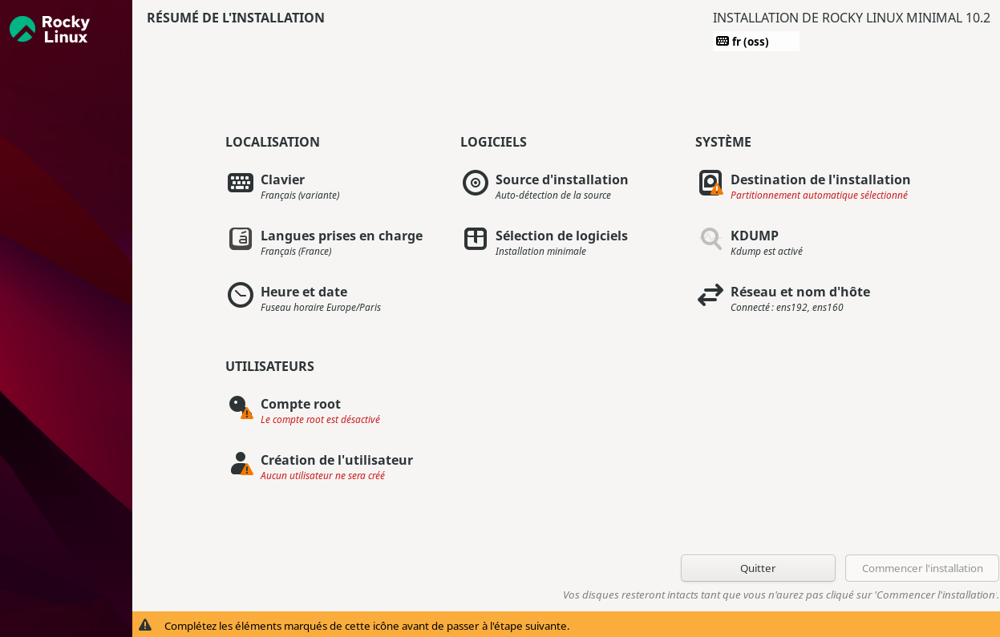

### 2.3 Configuration réseau lors de l'installation

- **NIC 1 (`ens160`)** : Activez le DHCP pour l'instant — l'IP statique sera configurée après.
- **NIC 2 (`ens192`)** : Désactivez IPv4 entièrement. Cette interface sera gérée exclusivement par Neutron (OVS bridge) et **ne doit pas avoir d'adresse IP système**.

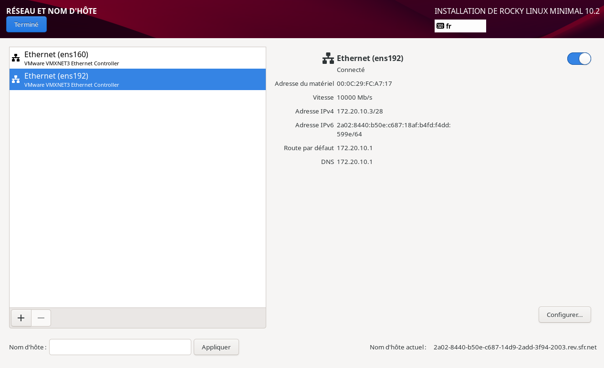
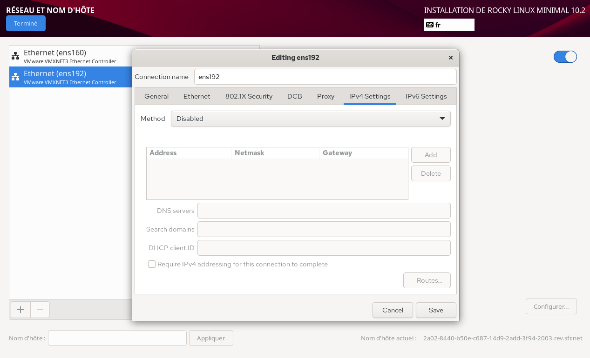
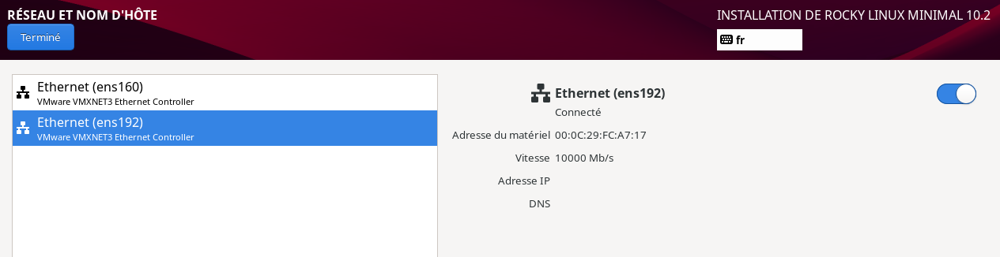

Validez toutes les configurations et lancez l'installation.

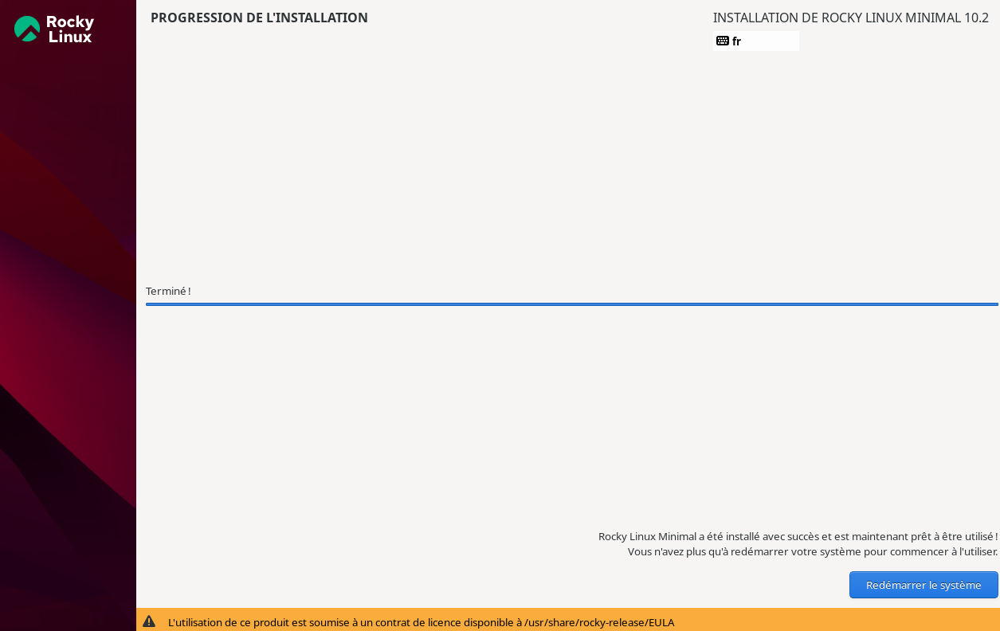

---

## Étape 3 — Configuration post-installation

Une fois Rocky Linux installé et la VM redémarrée, effectuez les opérations suivantes **en tant que `root`** sur `controller01` avant tout clonage.

---

### 3.1 Mise à jour du système

Mettez à jour tous les paquets installés pour partir d'un système propre et à jour.

```bash
# Mise à jour complète du système (noyau, bibliothèques, outils)
sudo dnf update -y
```

---

### 3.2 Création et configuration de l'utilisateur `kolla`

L'utilisateur `kolla` est l'utilisateur dédié à l'exécution de Kolla-Ansible sur tous les nœuds.
Il doit disposer des droits `sudo` sans mot de passe (requis par Ansible pour les tâches d'élévation de privilèges).

#### Ajout au groupe `wheel` (sudo)

```bash
# Ajout de l'utilisateur kolla au groupe wheel (administrateurs système)
usermod -aG wheel kolla

# Vérification — kolla doit apparaître dans la ligne wheel
grep wheel /etc/group
```

#### Autorisation sudo sans mot de passe pour le groupe wheel

Kolla-Ansible exécute de nombreuses tâches nécessitant `sudo` de manière automatisée.
Sans cette configuration, les playbooks Ansible s'arrêteront en demandant un mot de passe.

```bash
# Vérification syntaxique du fichier sudoers avant modification (sécurité)
sudo visudo -c

# Modification de sudoers :
#   - Commente la ligne "%wheel ALL=(ALL) ALL" (sudo avec mot de passe)
#   - Décommente la ligne "%wheel ALL=(ALL) NOPASSWD: ALL" (sudo sans mot de passe)
sudo sed -i \
  -e 's/^\s*%wheel\s*ALL=(ALL)\s*ALL\s*$/# &/' \
  -e 's/^\s*#\s*%wheel\s*ALL=(ALL)\s*NOPASSWD:\s*ALL\s*$/%wheel ALL=(ALL) NOPASSWD: ALL/' \
  /etc/sudoers

# Vérification syntaxique après modification — IMPORTANT, ne pas sauter cette étape
sudo visudo -c
```

---

### 3.3 Installation des paquets prérequis

Ces paquets sont nécessaires pour Kolla-Ansible et les opérations de déploiement.

```bash
# Outils d'archivage — requis pour certains rôles Ansible
sudo dnf install -y tar gzip unzip

# OpenSSL — requis pour la génération des certificats TLS (kolla-ansible certificates)
sudo dnf install -y openssl
```

---

### 3.4 Vérification des interfaces réseau

Après l'installation (et après chaque clonage), confirmez les noms d'interfaces réseau.
Les noms peuvent différer selon la configuration VMware ou le profil matériel.

```bash
# Affiche toutes les interfaces réseau et leurs adresses IP
ip a

# Alternative — affichage compact (nom + état + adresse IPv4 uniquement)
ip -br -4 addr show
```

> **Attendu :**
> - `ens160` — UP, avec une adresse IP (DHCP pour l'instant, statique après)
> - `ens192` — UP ou DOWN, **sans adresse IP** (sera gérée par Neutron)

---

### Clonage de la machine virtuelle de base

1. Éteignez la machine virtuelle de base (`controller01`) avant le clonage.
2. Utilisez l'option de clonage entièrement indépendante .

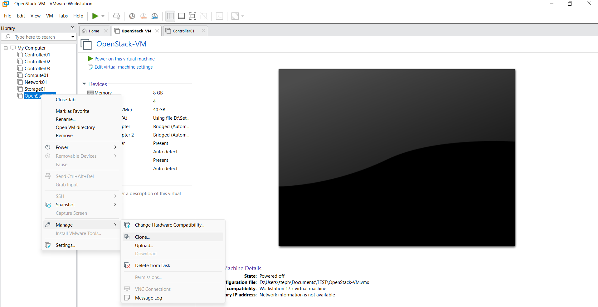

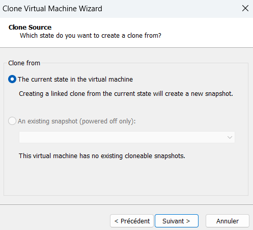

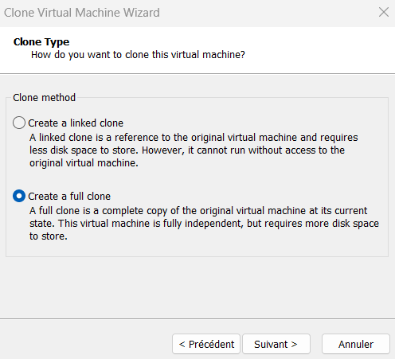

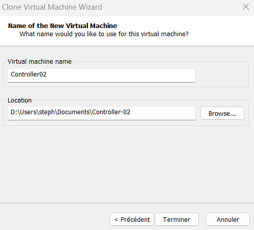

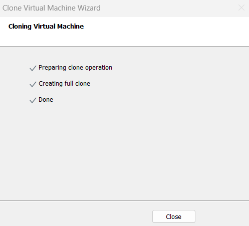

3. Répétez le processus pour créer l'architecture complète:
   - `controller02`, `controller03`, `compute01`, `network01`, `storage01`.

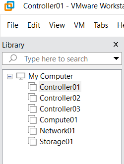

---

### Configurer le nom d'hôte et l'adresse IP statique pour toutes les machines virtuelles

Chaque machine virtuelle a besoin d'un nom d'hôte unique et d'une adresse IP statique .

1. Définir le nom d'hôte :
    ```bash
    sudo hostnamectl set-hostname <hostname>
    ```
2. Valider:
    ```bash
    hostname
    ```

3. Configurer une adresse IP statique pour `ens160`:
    ```bash
    nmcli device status
    ```

  ```bash
  sudo nmcli con mod ens160 ipv4.addresses 172.20.10.2/28
  sudo nmcli con mod ens160 ipv4.gateway 172.20.10.1
  sudo nmcli con mod ens160 ipv4.dns '8.8.8.8 1.1.1.1'
  sudo nmcli con mod ens160 ipv4.method manual
  ```

  ```bash
  sudo nmcli con down ens160 && sudo nmcli con up ens160
  ip a show ens160
  ```

Répétez l'opération pour chaque machine virtuelle ayant l'adresse IP et le nom d'hôte appropriés.

---

### Configurer  `/etc/hosts` on `controller01`

- Ce nœud servira d'hôte de déploiement pour Kolla-Ansible.
- Ce fichier garantit que tous les nœuds du cluster peuvent être référencés par leur nom d'hôte lors du déploiement Kolla Ansible.
- Les entrées DNS sur les autres nœuds seront gérées par Ansible.


1. Ouvrez le fichier hosts :
    ```bash
    sudo nano /etc/hosts
    ```

2. Ajoutez ces entrées :
    ```text
    172.20.10.2 controller01
    172.20.10.3 controller02
    172.20.10.5 controller03
    172.20.10.6 compute01
    172.20.10.7 network01
    172.20.10.8 storage01
    ```

3. Tester la portée :
    ```bash
    for host in controller01 controller02 controller03 compute01 network01 storage01; do
      ping -c 1 $host >/dev/null && echo "$host is reachable" || echo "$host is NOT reachable"
    done
    ```
---

### Activer la virtualisation sur les machines virtuelles de calcul (`compute01`)

1. Ouvrez les paramètres de la machine virtuelle pour chaque **nœud de calcul (`compute01`)** .

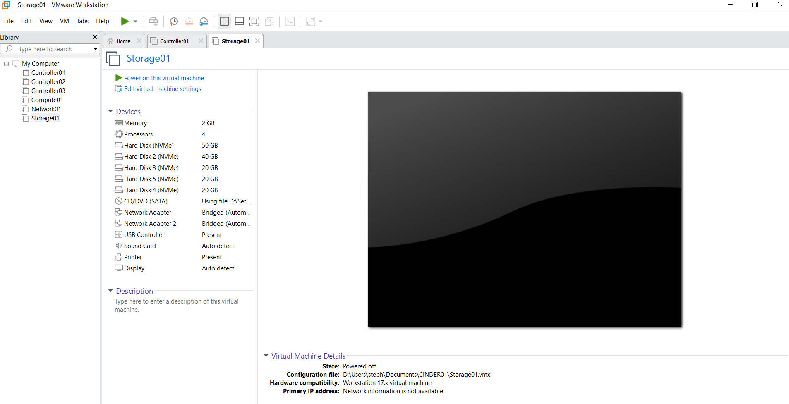

2. Activez la virtualisation dans les paramètres matériels.

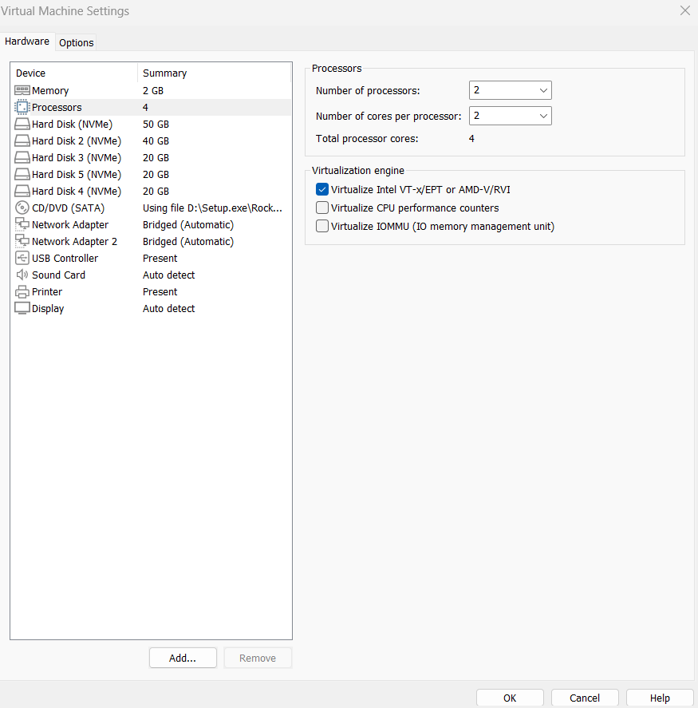

3. Répétez si vous avez plusieurs **nœud de calcul (`compute01, compute02...`)**.
