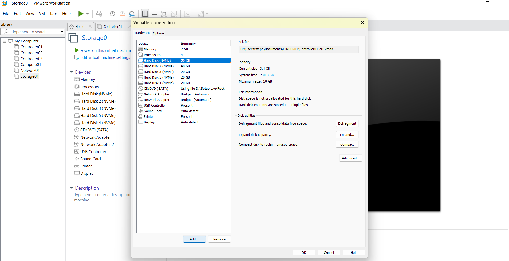
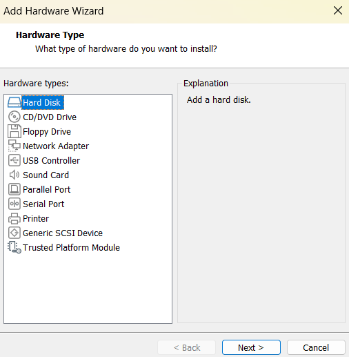
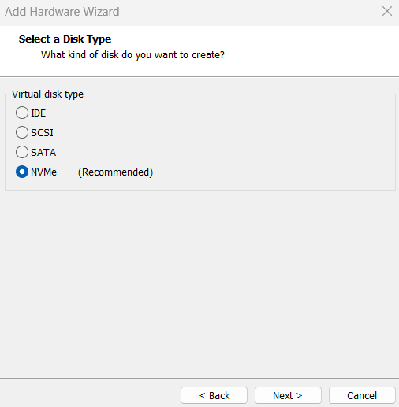
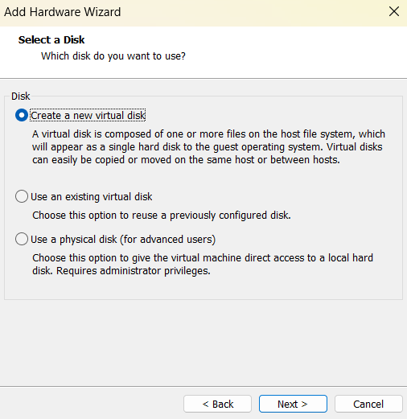
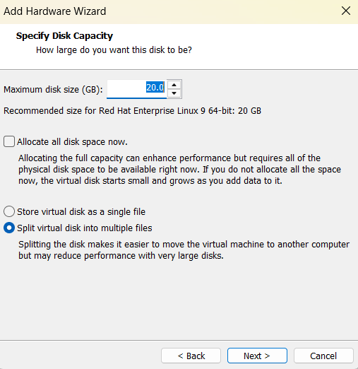

# Déploiement OpenStack HA avec Kolla-Ansible

<p align="center">
  
</p>

<p align="center">
  
  
  
  
</p>

---

## Table des matières

- [Présentation](#présentation)
- [Prérequis](#prérequis)
- [Environnement de test](#environnement-de-test)
- [Architecture du déploiement](#architecture-du-déploiement)
- [Rôles des nœuds](#rôles-des-nœuds)
  - [Contrôleurs](#contrôleurs----controller01-controller02-controller03)
  - [Réseau](#réseau----network01)
  - [Calcul](#calcul----compute01)
  - [Stockage](#stockage----storage01)
- [Interfaces réseau](#interfaces-réseau)
- [Services déployés](#services-déployés)
- [Étape 1 — Création de la VM de base](#étape-1--création-de-la-vm-de-base)
- [Étape 2 — Installation de Rocky Linux 10.2](#étape-2--installation-de-rocky-linux-102)
- [Étape 3 — Configuration post-installation](#étape-3--configuration-post-installation)
- [Étape 4 — Clonage et personnalisation des nœuds](#étape-4--clonage-et-personnalisation-des-nœuds)
- [Étape 5 — Configuration spécifique par rôle](#étape-5--configuration-spécifique-par-rôle)
- [Étape 6 — Partage NFS pour Glance](#étape-6--partage-nfs-pour-glance)

---

## Présentation

Ce projet documente le déploiement complet d'un environnement **cloud OpenStack à haute disponibilité (HA)** à l'aide de **Kolla-Ansible** sur **Rocky Linux 10.2**.

L'infrastructure repose sur les composants suivants :

- Architecture multi-nœuds : contrôleurs, calcul, réseau, stockage
- Conteneurisation complète avec **Docker**
- Cluster **Galera** + **HAProxy** + **Keepalived** pour la haute disponibilité
- Configuration centralisée via **Ansible**
- Machines virtuelles provisionnées sous **VMware Workstation**

> Ce guide s'adresse aux ingénieurs **DevOps**, aux architectes **cloud** et aux administrateurs système avancés souhaitant reproduire ce déploiement en laboratoire ou en production.

---

## Prérequis

Avant de commencer, assurez-vous de maîtriser les bases de :

- Administration **Linux** (gestion des utilisateurs, systemd, partitions)
- **Réseaux** (interfaces, routage, VLAN)
- **Ansible** (inventaires, playbooks, rôles)

---

## Environnement de test

| Composant | Version / Détail |
|-----------|-----------------|
| Système d'exploitation | Rocky Linux 10.2 (ISO minimal) |
| Plateforme cloud | OpenStack 2024.2 (Dalmatian) |
| Outil de déploiement | Kolla-Ansible |
| Moteur de conteneurs | Docker |
| Hyperviseur | VMware Workstation |
| Orchestrateur | Ansible |

---

## Architecture du déploiement

Le cluster est composé de **6 nœuds** provisionnés sous VMware Workstation. Une VM de base (`controller01`) a été créée puis clonée pour produire les nœuds supplémentaires. Chaque nœud fonctionne sous **Rocky Linux 10.2 (ISO minimal)** et dispose de ressources adaptées à son rôle.

| Nom d'hôte | Rôle | IPv4 | vCPU | RAM (Go) | Stockage (Go) | Notes |
|------------|------|------|------|----------|---------------|-------|
| `controller01` | Contrôleur | 172.20.10.2 | 8 | 24 | 150–200 | Nœud de déploiement Kolla |
| `controller02` | Contrôleur | 172.20.10.3 | 8 | 24 | 150–200 | |
| `controller03` | Contrôleur | 172.20.10.5 | 8 | 24 | 150–200 | |
| `compute01` | Calcul | 172.20.10.6 | 4 | 16 | 100 | Virtualisation imbriquée activée |
| `network01` | Réseau | 172.20.10.7 | 4 | 16 | 80 | |
| `storage01` | Stockage | 172.20.10.8 | 4 | 8 | 100 + 60 (Swift) | Volume LVM pour Cinder |

> ⚠️ **Règle de quorum HA :** Les nœuds contrôleurs doivent toujours être en **nombre impair** (3, 5, 7…) afin que le cluster MariaDB Galera et Keepalived puissent élire un leader en cas de défaillance.

---

## Rôles des nœuds

### Contrôleurs — `controller01`, `controller02`, `controller03`

Les nœuds de contrôle forment le **plan de contrôle** du cloud OpenStack. Ils hébergent toutes les API, la base de données, la messagerie et l'équilibrage de charge.

| Service | Description |
|---------|-------------|
| `Keystone` | Gestion des identités et authentification |
| `Glance` | Catalogue d'images (stockage local sur `/mnt/glance`) |
| `Nova API / Scheduler / Conductor` | Gestion des ressources de calcul |
| `Neutron Server` | API réseau |
| `Horizon` | Interface web (Dashboard) |
| `MariaDB (Galera)` | Base de données en cluster HA |
| `RabbitMQ` | File d'attente de messages (HA) |
| `Memcached` | Cache de sessions |
| `HAProxy + Keepalived` | Équilibrage de charge et VIP haute disponibilité |
| `Prometheus + Grafana` | Monitoring et métriques |

---

### Réseau — `network01`

Le nœud réseau gère toute la connectivité des instances.

| Service | Description |
|---------|-------------|
| `Neutron OVS Agent` | Réseaux overlay (VXLAN / GRE) |
| `Neutron L3 Agent` | Routage inter-réseaux et NAT |
| `Neutron DHCP Agent` | Attribution d'adresses IP aux instances |
| `Neutron Metadata Agent` | Fourniture de métadonnées aux instances |

---

### Calcul — `compute01`

Le nœud de calcul exécute les machines virtuelles des locataires (tenants).

| Service | Description |
|---------|-------------|
| `Nova Compute` | Cycle de vie des VMs |
| `Libvirt / KVM` | Hyperviseur pour l'exécution des VMs |
| `Neutron OVS Agent` | Connectivité réseau des VMs |
| `Ceilometer Compute` | Collecte de métriques au niveau compute |
| `Prometheus Node Exporter` | Monitoring des ressources du nœud |

---

### Stockage — `storage01`

Le nœud de stockage fournit du stockage persistant en mode bloc et objet.

| Service | Description |
|---------|-------------|
| `Cinder Volume` | Volumes bloc (backend LVM) |
| `Cinder Backup` | Sauvegarde des volumes vers Swift |
| `LVM` | Gestion des volumes logiques (`cinder-volumes`) |
| `iscsid / tgtd` | Services iSCSI pour les volumes Cinder |
| `Swift (account / container / object)` | Stockage objet distribué |
| `Prometheus Node Exporter` | Monitoring des ressources du nœud |

---

## Interfaces réseau

Chaque nœud dispose d'**au moins deux interfaces réseau** :

| Interface | Rôle | Configuration |
|-----------|------|---------------|
| `ens160` | Réseau de gestion (API, réplication, stockage) | IP statique |
| `ens192` | Réseau externe (IPs flottantes, provider networks) | Sans adresse IP — géré par Neutron (OVS bridge) |

> ⚠️ Les noms d'interfaces (`ens160`, `ens192`) peuvent varier selon la configuration de l'hyperviseur. Vérifiez toujours avec `ip a` après création ou clonage d'une VM.

---

## Services déployés

### Services cœur

| Service | Statut | Description |
|---------|--------|-------------|
| **Keystone** | ✅ Activé | Authentification et identité |
| **Glance** | ✅ Activé | Catalogue d'images |
| **Nova** | ✅ Activé | Service de calcul |
| **Neutron** | ✅ Activé | Service réseau (OVS) |
| **Horizon** | ✅ Activé | Dashboard web |
| **Heat** | ✅ Activé | Orchestration (stacks) |
| **Cinder** | ✅ Activé | Stockage bloc (LVM) |

### Monitoring et télémétrie

| Service | Statut | Description |
|---------|--------|-------------|
| **Prometheus** | ✅ Activé | Collecte de métriques |
| **Grafana** | ✅ Activé | Visualisation des métriques |
| **Ceilometer** | ✅ Activé | Collecte des données de consommation |
| **Aodh** | ✅ Activé | Alertes et alarmes |
| **Gnocchi** | ✅ Activé | Stockage des métriques (backend `file`) |

### Services avancés

| Service | Statut | Description |
|---------|--------|-------------|
| **Zun** | ✅ Activé | Gestion des conteneurs applicatifs |
| **Kuryr** | ✅ Activé | Intégration réseau pour les conteneurs |
| **Swift** | ✅ Activé | Stockage objet distribué |
| **Barbican** | ✅ Activé | Gestion des secrets et chiffrement |
| **Magnum** | ✅ Activé | Orchestration Kubernetes (clusters K8s) |
| **Designate** | ✅ Activé | DNS as a Service |
| **Octavia** | ✅ Activé | Load Balancer as a Service |

---

## Étape 1 — Création de la VM de base

Créez une VM de référence (`controller01`) qui servira de base pour le clonage de tous les autres nœuds.

### 1.1 Ressources matérielles

| Paramètre | Valeur recommandée |
|-----------|-------------------|
| vCPU | 4 (minimum 2) |
| RAM | 16 Go (minimum 8 Go) |
| Disque | 60 Go+ |
| Type de disque | Thin Provision |


### 1.2 Configuration réseau

Ajoutez **deux cartes réseau** à la VM :

| NIC | Mode VMware | Rôle OpenStack |
|-----|-------------|----------------|
| NIC 1 (`ens160`) | Bridged | API, réplication, stockage |
| NIC 2 (`ens192`) | Bridged | Provider networks, IPs flottantes |


---

## Étape 2 — Installation de Rocky Linux 10.2

> **Télécharger l'ISO Rocky Linux 10.2 (minimal) :** [https://rockylinux.org/download](https://rockylinux.org/download)

Démarrez la VM et lancez l'installation.


### 2.1 Langue d'installation

Sélectionnez la langue souhaitée (le Français est supporté).


### 2.2 Paramètres à configurer

| Paramètre | Recommandation |
|-----------|----------------|
| Partitionnement | Automatique ou manuel (LVM recommandé) |
| Réseau et nom d'hôte | Configurer `ens160` et `ens192` |
| Fuseau horaire | Votre région |
| Mot de passe root | Fort, noté en lieu sûr |
| Utilisateur dédié | `kolla` |


### 2.3 Configuration réseau

- **`ens160`** : Activez le DHCP pour l'instant — l'IP statique sera configurée après installation.
- **`ens192`** : Désactivez entièrement IPv4. Cette interface sera gérée exclusivement par Neutron (OVS bridge) et **ne doit pas avoir d'adresse IP système**.


Validez et lancez l'installation.


---

## Étape 3 — Configuration post-installation

Une fois Rocky Linux installé et la VM redémarrée, effectuez les opérations suivantes **en tant que `root`** sur `controller01`, **avant tout clonage**.

### 3.1 Mise à jour du système

```bash
sudo dnf update -y
```

### 3.2 Création et configuration de l'utilisateur `kolla`

L'utilisateur `kolla` exécutera Kolla-Ansible sur tous les nœuds. Il doit disposer de droits `sudo` sans mot de passe (requis pour les tâches d'élévation de privilèges Ansible).

```bash
# Ajout au groupe wheel (sudo)
usermod -aG wheel kolla

# Vérification
grep wheel /etc/group
```

Configurez ensuite `sudo` sans mot de passe pour le groupe `wheel` :

```bash
# Vérification syntaxique préalable
sudo visudo -c

# Modification de sudoers :
# - Commente  : %wheel ALL=(ALL) ALL
# - Décommente : %wheel ALL=(ALL) NOPASSWD: ALL
sudo sed -i \
  -e 's/^\s*%wheel\s*ALL=(ALL)\s*ALL\s*$/# &/' \
  -e 's/^\s*#\s*%wheel\s*ALL=(ALL)\s*NOPASSWD:\s*ALL\s*$/%wheel ALL=(ALL) NOPASSWD: ALL/' \
  /etc/sudoers

# Vérification syntaxique après modification — ne pas sauter cette étape
sudo visudo -c
```

### 3.3 Installation des paquets prérequis

```bash
# Outils d'archivage requis pour certains rôles Ansible
sudo dnf install -y tar gzip unzip

# OpenSSL requis pour la génération des certificats TLS
sudo dnf install -y openssl
```

### 3.4 Vérification des interfaces réseau

```bash
# Affichage de toutes les interfaces et adresses IP
ip a

# Affichage compact (nom + état + adresse IPv4)
ip -br -4 addr show
```

**Résultat attendu :**
- `ens160` — UP, avec une adresse IP (DHCP temporaire)
- `ens192` — UP ou DOWN, **sans adresse IP**

---

## Étape 4 — Clonage et personnalisation des nœuds

### 4.1 Clonage de la VM de base

1. Éteignez `controller01` avant de cloner.
2. Utilisez l'option **clonage entièrement indépendant** dans VMware.


3. Répétez pour créer : `controller02`, `controller03`, `compute01`, `network01`, `storage01`.


### 4.2 Nom d'hôte et adresse IP statique

À réaliser sur **chaque nœud** après clonage.

**Définir le nom d'hôte :**

```bash
sudo hostnamectl set-hostname <hostname>
hostname  # validation
```

**Configurer l'IP statique sur `ens160` :**

```bash
nmcli device status

sudo nmcli con mod ens160 ipv4.addresses 172.20.10.X/28
sudo nmcli con mod ens160 ipv4.gateway 172.20.10.1
sudo nmcli con mod ens160 ipv4.dns '8.8.8.8 1.1.1.1'
sudo nmcli con mod ens160 ipv4.method manual

sudo nmcli con down ens160 && sudo nmcli con up ens160
ip a show ens160  # validation
```

> Remplacez `172.20.10.X` par l'adresse IP correspondant au nœud (voir [tableau d'architecture](#architecture-du-déploiement)).

### 4.3 Fichier `/etc/hosts` sur `controller01`

`controller01` est le nœud de déploiement Kolla-Ansible. Ce fichier lui permet de résoudre tous les nœuds par nom d'hôte. Les entrées DNS sur les autres nœuds seront propagées par Ansible.

```bash
sudo nano /etc/hosts
```

Ajoutez les entrées suivantes :

```text
172.20.10.2  controller01
172.20.10.3  controller02
172.20.10.5  controller03
172.20.10.6  compute01
172.20.10.7  network01
172.20.10.8  storage01
```

Vérifiez la connectivité vers tous les nœuds :

```bash
for host in controller01 controller02 controller03 compute01 network01 storage01; do
  ping -c 1 $host >/dev/null && echo "$host : OK" || echo "$host : UNREACHABLE"
done
```

---

## Étape 5 — Configuration spécifique par rôle

### 5.1 Activer la virtualisation imbriquée sur `compute01`

La virtualisation imbriquée est requise pour que KVM fonctionne à l'intérieur d'une VM VMware.

1. Ouvrez les paramètres de la VM `compute01`.
2. Activez l'option de virtualisation dans les paramètres du processeur.


> Si vous disposez de plusieurs nœuds de calcul (`compute02`, etc.), répétez l'opération pour chacun.

### 5.2 Attacher et préparer le disque de stockage sur `storage01`

Cinder (stockage bloc) et Swift (stockage objet) nécessitent un disque dédié.

**Ajouter un disque virtuel dans VMware :**







**Vérifier la détection du disque :**

```bash
lsblk
```

**Initialiser le volume LVM pour Cinder :**

```bash
sudo pvcreate /dev/nvme0n2
sudo vgcreate cinder-volumes /dev/nvme0n2
sudo vgs  # validation
```

> Adaptez `/dev/nvme0n2` au nom de disque détecté par `lsblk` sur votre système.

---

## Étape 6 — Partage NFS pour Glance

Les trois contrôleurs doivent partager un répertoire commun `/mnt/glance` pour que le service Glance fonctionne en HA. `storage01` joue le rôle de serveur NFS.

> ⚠️ Ce montage constitue un point de défaillance unique. Il est suffisant pour un environnement de lab, mais une solution redondante (NAS/SAN) est recommandée en production.

### 6.1 Configurer le serveur NFS sur `storage01`

```bash
sudo dnf install -y nfs-utils

sudo mkdir -p /srv/nfs/glance
sudo chmod 755 /srv/nfs/glance

# Exporter le partage vers le réseau de management
echo "/srv/nfs/glance 172.20.10.0/24(rw,sync,no_subtree_check,no_root_squash)" | \
  sudo tee -a /etc/exports

sudo systemctl enable --now nfs-server
sudo exportfs -ra
sudo exportfs -v  # vérification

# Ouvrir le pare-feu
sudo firewall-cmd --permanent \
  --add-service=nfs \
  --add-service=rpc-bind \
  --add-service=mountd
sudo firewall-cmd --reload
```

> `no_root_squash` est requis : Ansible doit pouvoir corriger les permissions de ce dossier en tant que `root` lors du déploiement de Glance. Sans cette option, le conteneur `glance-api` échouera à écrire dans le répertoire.

### 6.2 Monter le partage sur les trois contrôleurs

À répéter sur **`controller01`**, **`controller02`** et **`controller03`** :

```bash
sudo dnf install -y nfs-utils

sudo mkdir -p /mnt/glance

# Remplacez 172.20.10.8 par l'IP réelle de storage01 si différente
echo "172.20.10.8:/srv/nfs/glance /mnt/glance nfs defaults,_netdev 0 0" | \
  sudo tee -a /etc/fstab

sudo mount -a
df -h /mnt/glance  # doit afficher le montage NFS, pas le disque local
```

### 6.3 Vérifier le partage entre les nœuds

```bash
# Depuis controller01
sudo touch /mnt/glance/test-partage

# Depuis controller02 et controller03
ls -la /mnt/glance/test-partage  # doit être visible sur les deux nœuds

# Nettoyage
sudo rm /mnt/glance/test-partage
```

> ⚠️ Si le fichier n'est pas visible sur les autres contrôleurs, **ne lancez pas `kolla-ansible deploy`** — le partage n'est pas correctement configuré.

### 6.4 SELinux sur Rocky Linux

Si SELinux est en mode `enforcing` (par défaut), le bind-mount NFS vers les conteneurs peut être bloqué. En cas d'erreurs de permission côté `glance-api` après déploiement malgré un montage fonctionnel :

```bash
# Diagnostiquer les refus SELinux
ausearch -m avc -ts recent

# Autoriser l'accès NFS par les conteneurs virtuels
sudo setsebool -P virt_use_nfs on
```
